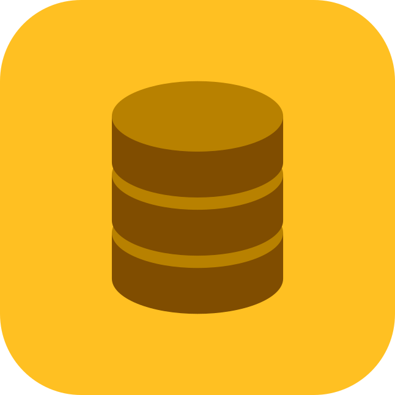

# Learn IndexedDB

## Project Description

- This project is about learning and experimenting with **IndexedDB,** a low-level API for client-side storage of significant amounts of structured data. This is a learning exercise to understand how IndexedDB works.

## Main Technologies Used

- 🫙 **IndexedDB:** The main technology being explored and learned in this project.
- 🕸️ **Web Technologies:** HTML, CSS, and JavaScript are used to create a user interface for interacting with IndexedDB.

## Resources

- 🔤 [Courier Prime](https://fonts.google.com/specimen/Courier+Prime) designed by [Alan Dague-Greene](https://fonts.google.com/?query=Alan%20Dague-Greene) in [Google Fonts](https://fonts.google.com)

## About

- 👨🏼‍💻 Developer: [Chessurisme](https://github.com/chessurisme)
- ⌛ Created: July 16, 2024
- 🎟️ License: [MIT License](https://choosealicense.com/licenses/mit)

All Rights Reserved 2024
